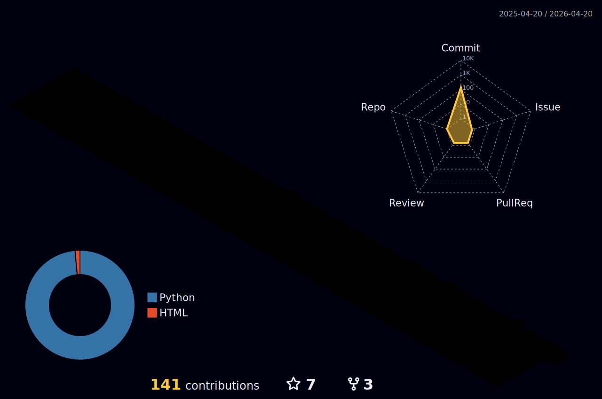
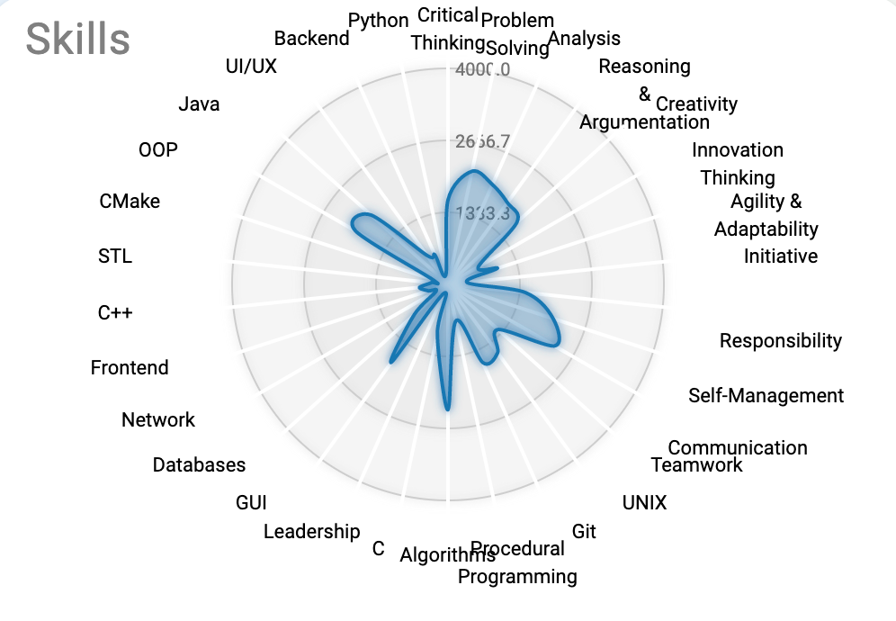

New line 2

<h3 align="center"> Hi there 👋 , I'm Sydoruk Andrii <h3>

I am a detail-oriented Python developer with Back-end experience in Cloud solutions and DevOps,
complemented by a background in Front-end development.
With experience in corporate environments, companies, startups, and freelance work.
Armed with strong Python experience, I am deeply committed to principles in good quality code
writing, innovating, and continued skill improvement toward the development of cutting-edge
software products and scalable systems.

<h2 align="center"> I'm a software engineer from Kyiv    Now located in London/Edinburgh  </h2>

🌎 Easy to move/Open to work  
🌱 I’m currently learning Frontend tools  
🔭 Worked in Pump/Codeavors  
💬 Ask me about Python  
🏁 Finished Ucode java,c, DevOps branch   

<h2 align="center"> 📫 How to reach me 📫   +447771392637 </h2>

    
    
    
    
    
    

<h2 align="center"> 🌎 Links 🌎 </h2>

    
    
    
    
    
    
    

<h2 align="center"> 🗿 Languages and Tools 🗿</h2>

<h2 align="center"><a href="https://github.com/nnocturnnn/T-Rex_JavaFX">OMAE WA MOU SHINDEIRU NANI</a></h2>

    

<h2 align="center">📈 Stats 📈</h2>

    

    
    

<!--  -->

    
    

<!--
**nnocturnnn/nnocturnnn** is a ✨ _special_ ✨ repository because its `README.md` (this file) appears on your GitHub profile.

Here are some ideas to get you started:

- 🔭 I’m currently working on ...
- 🌱 I’m currently learning ...
- 👯 I’m looking to collaborate on ...
- 🤔 I’m looking for help with ...
- 💬 Ask me about ...
- 📫 How to reach me: ...
- 😄 Pronouns: ...
- ⚡ Fun fact: ...
-->

